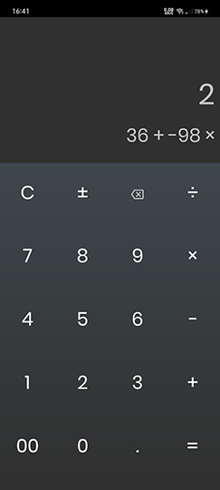

#  nCalc

A calculator for otakus where you can hide your nuke codes collection to protect the world.

My very first Android app that I can consider complete. It's a simple calculator app with additional features otakus might like, like the doujin code vault and able to set calculator background. We may wanna calculate how many waifus we already had. 😂

PS.: It does't have the said features yet. It doesn't also have any special function same as a full calcultor app like scientific functions and other stuff 'coz I'm still learning Android development.

## Basic Usage

It works just like how a simple calculator works.

- Hiding/accessing codes:
  - To hide doujin codes, type the code on the calculator. Press-and-hold on the final digit and it will be stored code vault.
  - To access the vault:
press-and-hold the `DECIMAL` button.

- Vault password:
  - Access the vault, then click the tri-dot menu and select `Settings > Password`. There you set/change/remove vault password.

## Download

Get the app from the [releases page](https://github.com/CarterSnich/nCalc/releases).

## Plan for updates

- Sci-fi like UI
- Background
- Convertions
- Open doujin codes to browser

## Contribute

Tell me what are your thoughts about my app and I will gladly accept your feedback.
Ping me using any of the links below.

## Get In Touch

- Email me at [jmestreraclosa@gmail.com](mailto:jmestreraclosa@gmail.com)
- Facebook [@jmestreraclosa.25](facebook.com/jmestreraclosa.25)
- Linkedin [Joe Mar Closa](https://www.linkedin.com/in/joe-mar-c-8244b5135)
